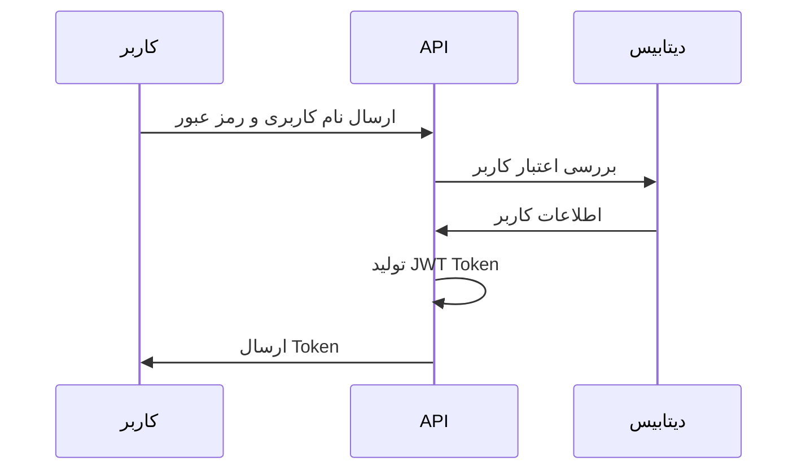
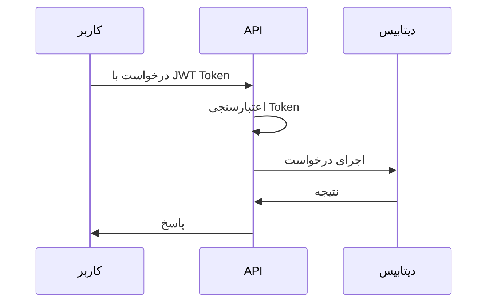

# احراز هویت - نمای کلی

این بخش شامل راهنمای کامل احراز هویت در سیستم پشتیبانی است.

## انواع احراز هویت

### 1. احراز هویت پایه

```javascript
// ورود با نام کاربری و رمز عبور
const loginData = {
  username: 'user@example.com',
  password: 'password123'
};

const response = await fetch('/api/auth/login', {
  method: 'POST',
  headers: {
    'Content-Type': 'application/json'
  },
  body: JSON.stringify(loginData)
});
```

### 2. احراز هویت JWT

```javascript
// استفاده از JWT Token
const token = 'eyJhbGciOiJIUzI1NiIsInR5cCI6IkpXVCJ9...';

const response = await fetch('/api/tickets', {
  headers: {
    'Authorization': `Bearer ${token}`
  }
});
```

### 3. احراز هویت دو مرحله‌ای

```javascript
// مرحله 1: ورود با نام کاربری و رمز عبور
const loginResponse = await fetch('/api/auth/login', {
  method: 'POST',
  headers: { 'Content-Type': 'application/json' },
  body: JSON.stringify({
    username: 'user@example.com',
    password: 'password123'
  })
});

// مرحله 2: ارسال کد تأیید
const verifyResponse = await fetch('/api/auth/verify-2fa', {
  method: 'POST',
  headers: { 'Content-Type': 'application/json' },
  body: JSON.stringify({
    token: loginResponse.data.tempToken,
    code: '123456'
  })
});
```

## جریان احراز هویت

### 1. ورود کاربر



### 2. استفاده از Token



## امنیت

### رمزگذاری رمز عبور

```javascript
const bcrypt = require('bcrypt');

// رمزگذاری رمز عبور
const hashedPassword = await bcrypt.hash(password, 12);

// بررسی رمز عبور
const isValid = await bcrypt.compare(password, hashedPassword);
```

### محدودیت تلاش

```javascript
const rateLimit = require('express-rate-limit');

const loginLimiter = rateLimit({
  windowMs: 15 * 60 * 1000, // 15 دقیقه
  max: 5, // حداکثر 5 تلاش
  message: 'تعداد تلاش‌های ورود بیش از حد مجاز است'
});
```

## مرحله بعدی

- [توکن‌ها](/docs/api/auth/tokens)
- [مجوزها](/docs/api/auth/permissions)
- [نمونه کدها](/docs/api/examples/javascript)

---

*آخرین به‌روزرسانی: ${new Date().toLocaleDateString('fa-IR')}*
