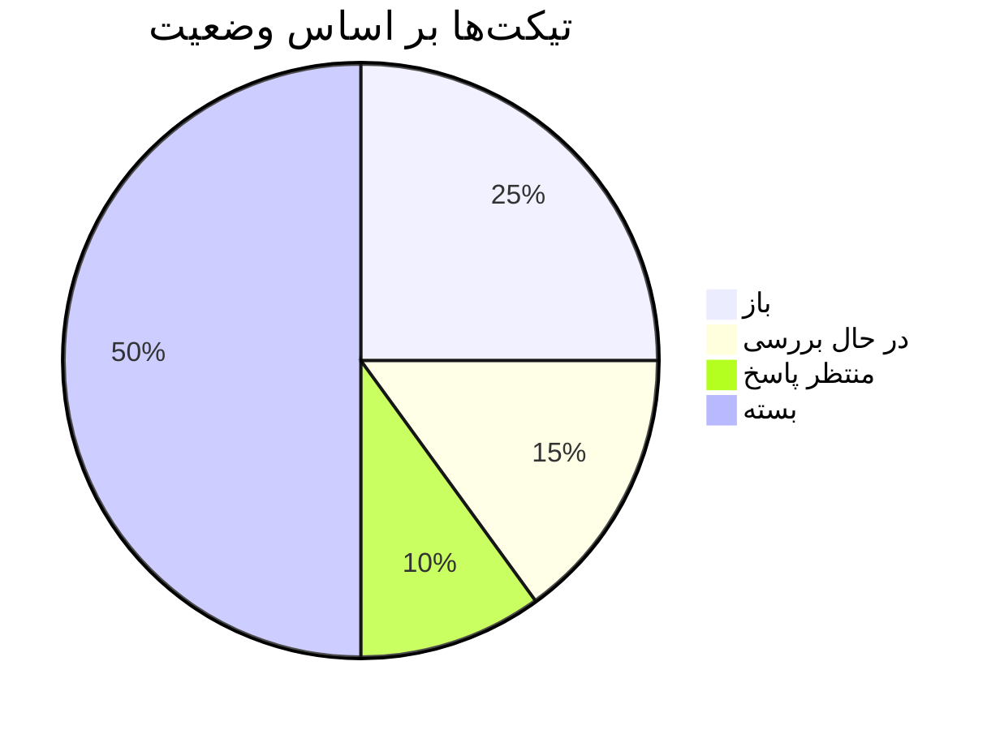
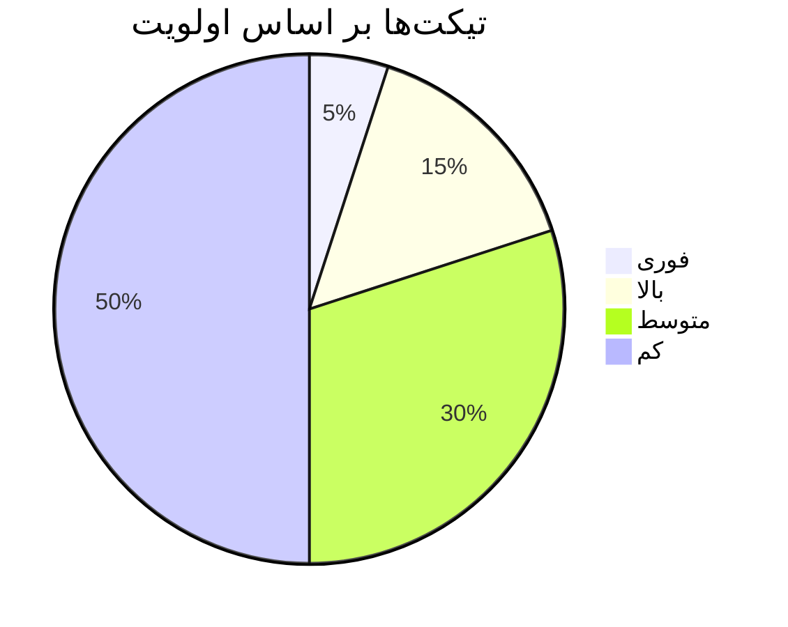

# داشبورد کاربری

داشبورد مرکز کنترل سیستم پشتیبانی است که نمای کلی از وضعیت سیستم را ارائه می‌دهد.

## نمای کلی

### آمار اصلی

در بالای داشبورد، آمار کلیدی سیستم نمایش داده می‌شود:

- **تیکت‌های باز**: تعداد تیکت‌های در انتظار پاسخ
- **تیکت‌های بسته**: تعداد تیکت‌های حل شده
- **زمان پاسخ‌دهی متوسط**: میانگین زمان پاسخ به تیکت‌ها
- **رضایت کاربران**: امتیاز رضایت از خدمات

### نمودارها

#### نمودار تیکت‌ها بر اساس وضعیت



#### نمودار تیکت‌ها بر اساس اولویت



## بخش‌های مختلف

### 1. تیکت‌های اخیر

لیست آخرین تیکت‌های ایجاد شده:

| موضوع | کاربر | وضعیت | تاریخ |
|-------|-------|--------|-------|
| مشکل لاگین | علی احمدی | باز | 1403/01/15 |
| درخواست ویژگی جدید | مریم رضایی | در حال بررسی | 1403/01/14 |
| گزارش باگ | حسن محمدی | بسته | 1403/01/13 |

### 2. فعالیت‌های اخیر

تاریخچه آخرین فعالیت‌های سیستم:

- **14:30** - تیکت جدید ایجاد شد: "مشکل لاگین"
- **14:25** - پاسخ ارسال شد به تیکت: "درخواست ویژگی جدید"
- **14:20** - کاربر جدید ثبت شد: "علی احمدی"

### 3. هشدارها

هشدارهای مهم سیستم:

- ⚠️ **3 تیکت** بیش از 24 ساعت بدون پاسخ
- 🔴 **1 تیکت فوری** در انتظار بررسی
- 📊 **زمان پاسخ‌دهی** بالاتر از حد معمول

## سفارشی‌سازی داشبورد

### تغییر چیدمان

1. روی آیکون "تنظیمات" کلیک کنید
2. بخش "چیدمان داشبورد" را انتخاب کنید
3. ویجت‌های مورد نظر را فعال/غیرفعال کنید
4. ترتیب نمایش را تغییر دهید

### فیلتر کردن داده‌ها

#### فیلتر زمانی

- **امروز**: فقط داده‌های امروز
- **هفته جاری**: داده‌های 7 روز گذشته
- **ماه جاری**: داده‌های 30 روز گذشته
- **سفارشی**: انتخاب بازه زمانی دلخواه

#### فیلتر کاربر

- **همه کاربران**: نمایش تمام کاربران
- **کاربر خاص**: انتخاب کاربر مشخص
- **گروه کاربری**: فیلتر بر اساس نقش

## گزارش‌گیری

### گزارش‌های از پیش تعریف شده

#### گزارش عملکرد روزانه

```bash
# دریافت گزارش عملکرد روزانه
curl -X GET "http://localhost:3000/api/reports/daily" \
  -H "Authorization: Bearer YOUR_TOKEN"
```

#### گزارش رضایت کاربران

```bash
# دریافت گزارش رضایت
curl -X GET "http://localhost:3000/api/reports/satisfaction" \
  -H "Authorization: Bearer YOUR_TOKEN"
```

### گزارش‌های سفارشی

1. به بخش "گزارش‌ها" بروید
2. "گزارش جدید" را کلیک کنید
3. پارامترهای مورد نظر را انتخاب کنید:
   - بازه زمانی
   - نوع داده
   - فرمت خروجی
4. گزارش را تولید کنید

## اعلان‌ها

### تنظیمات اعلان

در بخش "تنظیمات" → "اعلان‌ها":

- **ایمیل**: دریافت اعلان‌ها از طریق ایمیل
- **پیامک**: دریافت اعلان‌ها از طریق پیامک
- **مرورگر**: اعلان‌های مرورگر
- **اپلیکیشن موبایل**: اعلان‌های اپ

### انواع اعلان

- **تیکت جدید**: هنگام ایجاد تیکت جدید
- **پاسخ جدید**: هنگام دریافت پاسخ
- **تغییر وضعیت**: هنگام تغییر وضعیت تیکت
- **یادآوری**: یادآوری تیکت‌های بدون پاسخ

## میانبرهای صفحه‌کلید

برای استفاده سریع‌تر از داشبورد:

- **Ctrl + N**: تیکت جدید
- **Ctrl + S**: جستجو
- **Ctrl + F**: فیلتر
- **Ctrl + R**: به‌روزرسانی
- **Esc**: بستن پنجره‌های باز

## نکات مهم

- **به‌روزرسانی خودکار**: داشبورد هر 30 ثانیه به‌روزرسانی می‌شود
- **کش**: داده‌ها برای بهبود عملکرد کش می‌شوند
- **پشتیبان‌گیری**: گزارش‌ها به صورت خودکار پشتیبان‌گیری می‌شوند

## مرحله بعدی

- [ویژگی‌های سیستم](/docs/user-guide/features)
- [تنظیمات کاربری](/docs/user-guide/settings)
- [راهنمای پیشرفته](/docs/advanced/customization)

---

*آخرین به‌روزرسانی: ${new Date().toLocaleDateString('fa-IR')}*
